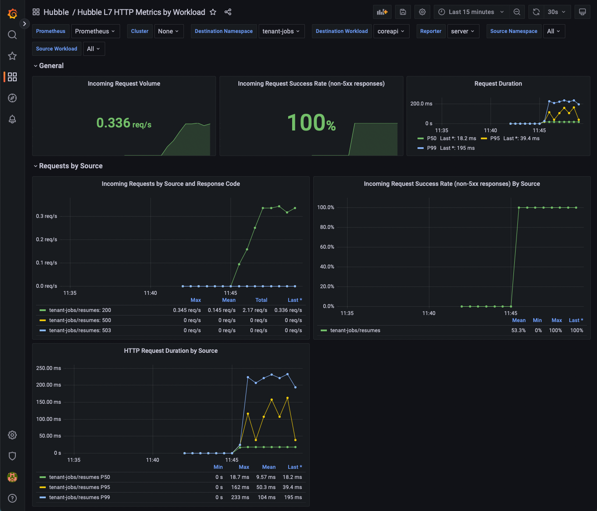

# Cilium Grafana Observability Demo

This demo walks through setting up a Kubernetes cluster, installing Cilium, and using it with Grafana to monitor your applications using the HTTP L7 visibility from Hubble.

## Setup

First, make sure you init the submodules, we need a custom checkout of cilium which has the latest chart updates.
This should not be necessary after the next cilium 1.13 release candidate:

```
git submodule update --init
```

We're going to use [KIND](https://kind.sigs.k8s.io) to setup our Kubernetes cluster.
All you need is access to a host running Docker.

This will create a KIND cluster without the default CNI so we can use cilium:

```
kind create cluster --config kind-config.yaml
```

Next we need to add a few helm repos:
```
helm repo add cilium https://helm.cilium.io
helm repo add ingress-nginx https://kubernetes.github.io/ingress-nginx
helm repo add prometheus-community https://prometheus-community.github.io/helm-charts
helm repo add open-telemetry https://open-telemetry.github.io/opentelemetry-helm-charts
helm repo add minio https://operator.min.io
helm repo add grafana https://grafana.github.io/helm-charts
helm repo add strimzi https://strimzi.io/charts
helm repo add elastic https://helm.elastic.co
```

And we're going to install the Prometheus-operator CRDs before cilium, to avoid issues installing the Cilium ServiceMonitor:
```
helm template kube-prometheus prometheus-community/kube-prometheus-stack --include-crds \
  | yq 'select(.kind == "CustomResourceDefinition") * {"metadata": {"annotations": {"meta.helm.sh/release-name": "kube-prometheus", "meta.helm.sh/release-namespace": "monitoring"}}}' \
  | kubectl create -f -
```

Additionally, we're going to create the monitoring namespace ahead of time, which is where Cilium will install the Hubble Grafana dashboards:
```
kubectl create ns monitoring
```

## Deployment

In this demo, we will be deploying Cilium, Ingress-nginx, Prometheus, Tempo, and Grafana.
Afterwards we will install the Isovalent "jobs-app" for demoing the Hubble HTTP metrics.

### Cilium Install

Next, let's install Cilium:

```
# masterIP is needed for kubeProxyReplacement
MASTER_IP="$(docker inspect kind-control-plane | jq '.[0].NetworkSettings.Networks.kind.IPAddress' -r)"
helm upgrade cilium ./cilium/install/kubernetes/cilium \
  --install \
  --wait \
  --namespace kube-system \
  --values helm/cilium-values.yaml \
  --set kubeProxyReplacement=strict \
  --set k8sServiceHost="${MASTER_IP}" \
  --set k8sServicePort=6443
```

Next, check the pods, and run the `cilium status` once everything is `Running`:
```
kubectl get pods -n kube-system
cilium status --wait
```

### ingress-nginx install

We use ingress-nginx to access Grafana.

```
helm upgrade ingress-nginx ingress-nginx/ingress-nginx \
  --install \
  --wait \
  --namespace ingress-nginx --create-namespace \
  --version 4.1.3 \
  --values helm/ingress-nginx-values.yaml
```

### OpenTelemetry operator and collector

This will be how we send traces to Tempo

```
helm upgrade opentelemetry-operator open-telemetry/opentelemetry-operator \
  --install \
  --wait \
  --namespace opentelemetry-operator --create-namespace \
  --version 0.15.0 \
  -f helm/opentelemetry-operator-values.yaml
kubectl apply -n opentelemetry-operator -f manifests/otel-collector.yaml
```

### Tempo install

Tempo will receive our traces from the OTEL collector.

```
helm upgrade tempo grafana/tempo \
  --install \
  --wait \
  --namespace tempo --create-namespace \
  --create-namespace \
  --version 0.16.2 \
  -f helm/tempo-values.yaml
```

### Prometheus & Grafana install

Prometheus will be used for collecting andstoring the metrics produced by Hubble and Grafana will be used to visualize the metrics.

```
helm upgrade kube-prometheus prometheus-community/kube-prometheus-stack \
   --install \
   --wait \
   --namespace monitoring --create-namespace \
   --version 40.3.1 \
   --values helm/prometheus-values.yaml
```

Now you should be able to visit Grafana in your browser at http://grafana.127-0-0-1.sslip.io with the username `admin`, password `password`.

### jobs-app install

Next we're going to deploy the jobs-app which includes a L7 CiliumNetworkPolicy so Hubble will generate metrics based on the HTTP flows, and some optional support for for tracing.

```
helm dep build ./helm/jobs-app
helm upgrade jobs-app ./helm/jobs-app \
  --install \
  --wait \
  --create-namespace \
  --namespace tenant-jobs \
  -f helm/jobs-app-values.yaml
```

To view the CiliumNetworkPolicy run:
```
kubectl get ciliumnetworkpolicy -n tenant-jobs -o yaml
```

## Demo

Before we get too far, let's go over the different components:

- `coreapi` is a RESTFUL HTTP main API used by the resumes, recruiter, and jobpoisting components. It manages creating, retrieving and listing resumes and jobpostings from Elasticsearch.
- `crawler` will periodically generate random resumes and sends them to `loader` via gRPC.
- `loader` is a gRPC service which submits resumes into a the `resumes` kafka topic to be processed by the `resumes` component.
- `resumes` subscribes to the `resumes` kafka topic, and submits the resumes to the `coreapi`, which stores them in Elasticsearch.
- `elasticsearch` stores resumes, job postings, and analytics
- `kafka` takes resumes in from `loader` in the `resumes` topic.
- `jobposting` Uses the `coreapi` to lists job postings on a web UI and allows applicants to submit their resumes.
- `recruiter` Uses the `coreapi` to list applicants and allows you to view their resumes.

First, open [Grafana and the Hubble L7 HTTP metrics By Workload dashboard][grafana-dashboard].

You should start to see some metrics being populated.



Everything in the dashboard is just using the Hubble HTTP metrics, without any instrumentation required from the application, and without any being injected into the applicantion.

From the dashboard, find the `Destination Workload` variable at the top of the page, and select `loader`.

Next, lets increase the request volume by configuring crawler to generate more resumes and by running more than 1 replica of the crawler:

```
helm upgrade jobs-app isovalent/jobs-app --namespace tenant-jobs --reuse-values -f helm/jobs-app-increased-request-rate.yaml
```

Now go back into [Grafana][grafana-dashboard].
You should see the request rate increase as a result of the increased resume generation rates by crawler.


Now go back to the `Destination Workload` variable at the top of the page, and select `coreapi`.
You should see the request rate increase for `coreapi` as well.


Next, let's deploy a new configuration of our app and use our metrics to see the change in the request error rate.

```
helm upgrade jobs-app isovalent/jobs-app --namespace tenant-jobs --reuse-values -f helm/jobs-app-increased-error-rate.yaml
```

Now go back into [Grafana][grafana-dashboard].
You should see the error rate increase as a result of coreapi configuration changing.


Next, let's deploy a new configuration of our app and use our metrics to see the change in the request duration.

```
helm upgrade jobs-app isovalent/jobs-app --namespace tenant-jobs --reuse-values -f helm/jobs-app-increased-request-duration.yaml
```

Now go back into [Grafana][grafana-dashboard].
You should see the request durations increase as a result of coreapi configuration changing.


### Tracing integration

If your application exports tracing headers, Hubble can be configured to extract these trace IDs from http headers and export them with the Hubble HTTP metrics as [Exemplars](https://grafana.com/docs/grafana/v9.0/basics/exemplars/) which allow us to link from metrics to traces in Grafana.

As it happens, the jobs-app has support for creating traces using [OpenTelemetry](https://opentelemetry.io).

Next, let's deploy the jobs-app with tracing enabled:

```
helm upgrade jobs-app isovalent/jobs-app --namespace tenant-jobs --reuse-values -f helm/jobs-app-enable-tracing.yaml
```

Now go back into [Grafana][grafana-dashboard].
In the HTTP Request Duration by Source/Destination panels, you should start to see the exemplars showing up as dots alongside the line graph visualizations.
Each one of these exemplars represents the duration of a single request and links to a trace ID.


If you mouse over an examplar in Grafana, you will see metadata about the metric, and one of these fields should be `traceID` and should have a link you can click on to view the trace in Tempo.


Go ahead and find some exemplars and open them in Tempo.
You should see that some requests are slower than others and some of the requests fail and get retried by the clients.

A trace where everything was successful:


A trace where a request failed and was retried and succeeded the second time:


In summary, by using Cilium's L7 network policies you can get insight into how your application is behaving without any changes to the application, and without any sidecars.
Additionally, if your application already supports distributed tracing, Cilium enhances it by integrating traces with Hubble flows.

[grafana-dashboard]: http://grafana.127-0-0-1.sslip.io/d/3g264CZVz/hubble-l7-http-metrics-by-workload?orgId=1&refresh=30s&var-DS_PROMETHEUS=Prometheus&var-cluster=&var-destination_namespace=tenant-jobs&var-destination_workload=coreapi&var-reporter=server&var-source_namespace=All&var-source_workload=All&from=now-15m&to=now
